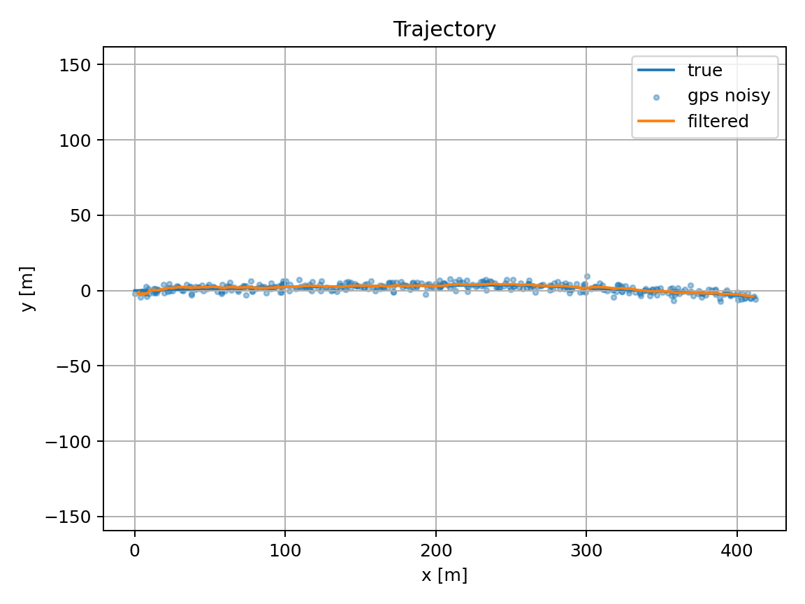
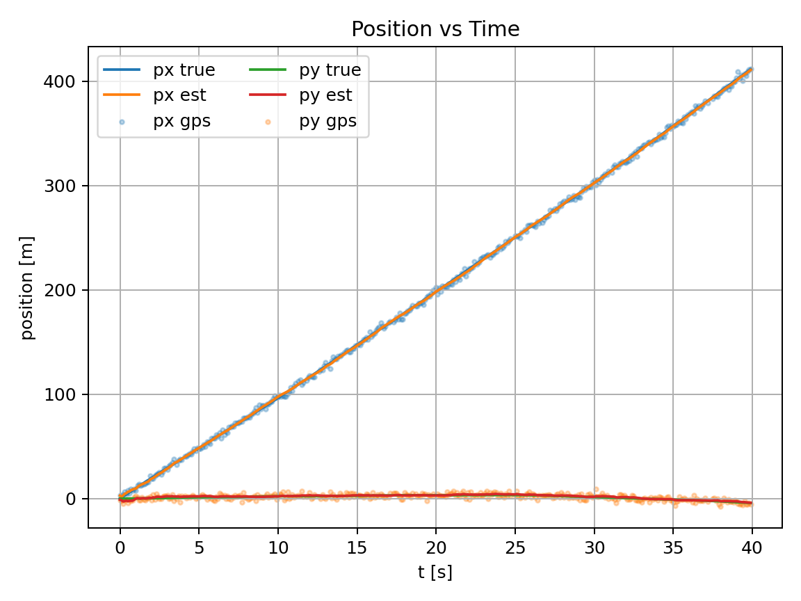
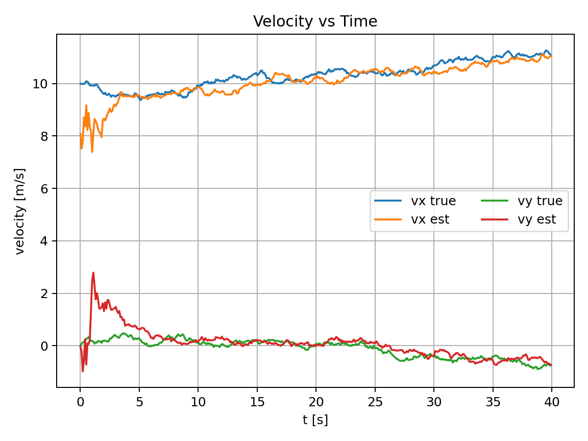
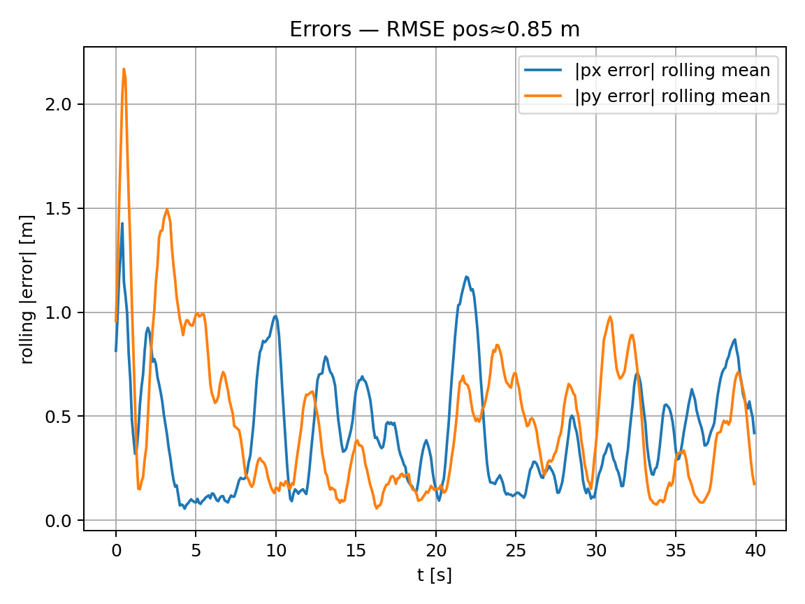

# Project Title: Multi-Sensor State-Space Models with Kalman Filtering

## Overview

This project simulates a 2D moving target observed by multiple noisy sensors and estimates its state using Kalman-family filters. It includes a classic linear Kalman Filter (KF), an Extended Kalman Filter (EKF) for nonlinear radar measurements, and an Unscented Kalman Filter (UKF). Plots and CSVs are generated to visualize and evaluate tracking performance.

## Key Features

* Simulates 2D constant-velocity motion with optional coordinated turn.
* Multi-sensor measurements: GPS-like position, IMU-like acceleration (with bias), and nonlinear radar (range/bearing).
* From-scratch implementations:

  * **KF** (linear predict/update, multi-sensor fusion).
  * **EKF** (analytic Jacobians for radar).
  * **UKF** (sigma points; unscented transform).
* Saves **CSV data**, **PNG plots**, and **summary.json** with RMSE metrics.
* Optional validation against `filterpy` or `pykalman` if installed.

## Example Output

```
Model: kf
RMSE pos (m): 0.847
RMSE vel (m/s): 0.642
```









## Skills Demonstrated

* State-space modeling & sensor fusion (KF/EKF/UKF)
* Numerical linear algebra (covariances, Jacobians, sigma points)
* Python (NumPy, Matplotlib), CLI tooling, reproducible simulation workflows

## How to Run
```
pip install numpy matplotlib

pip install scipy filterpy pykalman
python kalman_filter_demo.py --model kf --steps 300 --dt 0.1 --save_dir outputs
python kalman_filter_demo.py --model ekf --radar --gps --steps 600 --turn_rate 0.01
python kalman_filter_demo.py --model ukf --radar --compare_lib --no_plot
```
